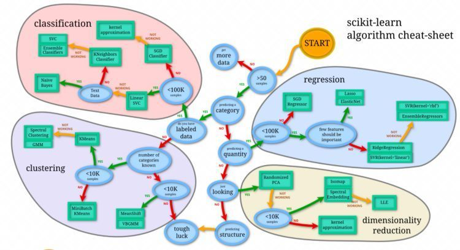

MACHINE LEARNING 

## **Overview**
This repo contains libraries, algorithms, techniques, projects,  courses and books that have helped me stregthen my understanding of this domain. This is more so to document my learning experience and what I found helpful to understand the diffeerences across algorithms/techniques/libraries/frameworks conceptually as well as implementation wise. The order of the material also helped me to build my foundational knowledge to more advanced to more niche applications. If the organization of content helps someone else in their Machine Learning journey than even better.

# **Table Of Contents**

### **Libraries/Tools/Frameworks**
1. [Python]()
2. [R]()
3. [Weka]()
4. [Waffles]()
5. [Java]()

### **Algorithms by Type**
1. Classification
    * [Logistic Regression]()
    * [Linear Discriminant Analysis]()
    * [kNeighbors classifier]()
    * [DecisionTree classifier]()
    * [Gaussian NB]()
    * [SVC]()
2. Regression 
    * [Linear]()
    * [LASSO]()
    * [Elastic Net]()
    * [KNeighbors Regressor]()
    * [DecisionTree Regressor]()
    * [SVR]()
3. Ensemble
    * [TBD]()
    * [TBD]()

### **Algorithms by Techniques**
1. Supervised: Outcome is predicted
    * [TBD]()
    * [TBD]()
    * [TBD]()
2. Unsupervised: Finding structure or patterns in data
    * [TBD]()
    * [TBD]()
    * [TBD]()
3. [Reinforcement Learning]()
4. [Deep Learning]()
5. [Time Series]()

### **Algorithms by Similarity in the way they work**
1. Regression: Linear, polynomial, logistic, stepwise, MARS, LOESS
2. Regularization: Ridge, Lasso, Elastic-Net, LARS
3. Instance-based: KNN, SVM, Learning Vector quantization (LVQ), Self-organizing-map (SOM)
4. Decision Trees: CART, ID3, CHAID, M5
5. Bayesian: Naïve Bayes, Gaussian Naïve Bayes, Multinomial Naïve Bayes, & BN
6. Clustering: K-means, K-medians, Hierrachial clustering, Expectation maximization (EM)
7. Association Rule learning: Apriori, and elcat
8. Artificial network:  Perceptron, MLP, Back-propagation, Stochastic gradient descent, Hopfield network, radial bias function network (RBFN)
9. Deep learning: CNN, RNN, LSTM, stocked-auto-encoders, DBM, & DBN
10.	Dimensionality reduction: PCA, LDA, Multidimensional scaling (MDS)
11.	Ensemble: Boosting, bagging, AdaBoost, Random Forest, Stacked generalization (Stacking), gradient boosting machines (GBM)

### **Projects**
1. [TBD]()
2. [TBD]()

### **Courses**
1. [Machine learning introduction: Udacity]()
2. [Machine learning with Python: Udemy]()
3. [Machine learning nanodegree: Udacity]()
4. [Artifical intelligence for trading nanodegree: Udacity]()

### **Books**
1. [The elements of statistical learning](https://www.amazon.com/Elements-Statistical-Learning-Prediction-Statistics/dp/0387848576/ref=sr_1_1?crid=2XPKR849OSNCZ&keywords=elements+of+statistical+learning&qid=1577954811&sprefix=elements+of+stat%2Caps%2C314&sr=8-1)
2. [An Introduction to statistical learning](https://www.amazon.com/Introduction-Statistical-Learning-Applications-Statistics/dp/1461471370/ref=pd_sbs_14_1/144-1773065-8441433?_encoding=UTF8&pd_rd_i=1461471370&pd_rd_r=ffcdf89e-b4f5-4e7e-957a-4a9433af04be&pd_rd_w=2g5f0&pd_rd_wg=B1s1G&pf_rd_p=7c0dad87-8a25-4c4f-9349-026039ea6cb3&pf_rd_r=A2CYH63HWJAK3GTWMJ5P&psc=1&refRID=A2CYH63HWJAK3GTWMJ5P)
3. [Hands on machine leanring with scikit learn and tensor flow](https://www.amazon.com/Hands-Machine-Learning-Scikit-Learn-TensorFlow/dp/1491962291/ref=sr_1_3?crid=2X67A4P8554EG&keywords=hands+on+machine+learning+with+scikit+learn+and+tensorflow&qid=1577954886&s=books&sprefix=hands+on+machine+leanring%2Cstripbooks%2C205&sr=1-3)
4. [Programming Collective Intelligence](https://www.amazon.com/Programming-Collective-Intelligence-Building-Applications/dp/0596529325/ref=sr_1_1?crid=3OH6J6PTKML2D&keywords=programming+collective+intelligence&qid=1577954908&s=books&sprefix=programming+collec%2Cstripbooks%2C195&sr=1-1)
5. [Artifical Intelligence - A modern approach](https://www.amazon.com/Artificial-Intelligence-Approach-Stuart-Russell/dp/9332543518/ref=sr_1_1?keywords=artificial+intelligence+a+modern+approach+peter+norvig&qid=1577954967&s=books&sr=1-1)